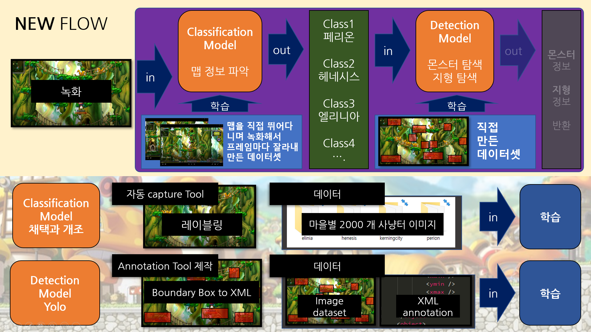
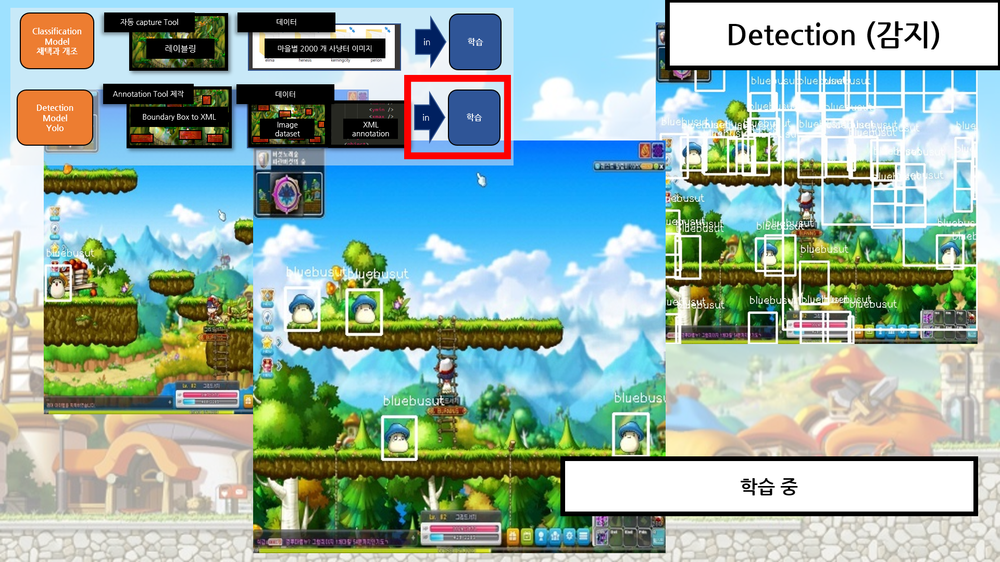
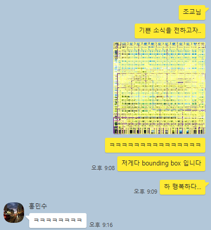

# MAiEye

**May I** give<br>
**Maplestory** <br>
**Ai** <br>
and <br>
**Eye?** <br>


<br>

이 프로젝트는 https://github.com/yangjae-ai-school/Individual-Project 에서 옮겨진 것으로, <br>
저장소가 완전히 꼬여 고장나버렸기 때문에 부득이 이사하게 되었음을 알립니다. <br>


<br>




<br>
<br>


<br>
<br>





<br>
<br>





## How to Run? 


### for Windows


(base) C: *[your root]* \MAiEye\Project> 
python start.py 
```
--labeltype map
-v C:\Users\user\Desktop\programming_PROJECTS\MAiEye\Data\maplestory_video_source\perion\move
-sp C:\Users\user\Desktop\programming_PROJECTS\MAiEye\Data\maplestory_map_source\perion 
-ms 1
--label perion
--imagesize 80
```


```python

ap = argparse.ArgumentParser()
ap.add_argument("-s", "--labeltype", type=str, help="[string] : type of video. Is it map of mob?")
ap.add_argument("-v", "--video", type=str, help="[string] : path to input video file")
ap.add_argument("-t", "--tracker", type=str, help="[string] : BOOSTING, MIL, KCF, TLD, MEDIANFLOW, GOTURN, MOSSE, CSRT")
ap.add_argument("-l", "--label", type=str, help="[string] : label name")
ap.add_argument("-ms", "--milliseconds", type=int, help="[int] : save image per n milliseconds")
ap.add_argument("-sp", "--savepath", type=str, help="[string] : saving path (absolute path , 절대경로), 경로가 존재하지 않으면 저장되지 않을 수 있어요!")
ap.add_argument("-is", "--imagesize", type=int, help="[int] : map 옵션 을 선택할 때에만 지정. N * N 으로 사진이 저장됨")
args = vars(ap.parse_args())

```


## Folder - Project

 - 프로젝트 폴더입니다.
 
| Title | Subject | Original Source & reference | 이용목적 | 관계 |
|-------|:-------:|:----------------------------|:--------:|:----:|
| Darkflow | | | Yolo Model | 1. tiny yolo maple Model 의 Trained Weight 가 저장되어 있음.<br>|
| JanghooModule| MapCapture | | | |
| | RoIExtraction | | | |
| | RunWithMapleGUI | | | |

<br>
<br>


## Folder - Study

 - 프로젝트에 필요한 공부를 한 내용들을 정리해 담았습니다.
 
| Title | Subject | 학습경로 | 정리여부 | 학습 성취도 |
|---|:---:|:---|:---:|:---:|
| Basics of Data Analysis | ML | School / Sejong Univ (pf. Jaewook Song) | x | 100% |
| Deep Leraning Zero to All 1 | AI | Youtube (pf. Sung kim) | x | 100% |
| 양재 AI School Summer Camp | AI | Yangjae | o | ? |
| CS231N | CV | Youtube / Stanford Univ (pf. Fei-Fei Li) | o | 20% |
| Computer Vision | CV | ... | o | ? |
| Django Tutorial | Web Server | Django Official Hompage | o | 20% |
| 생활코딩 Database | Web Server | Opentutorials.org | x | 30% |

<br>

### CS231N Source


- Youtube : 'CS231N official spring 2017'
> 1. https://youtu.be/vT1JzLTH4G4

- Blog : 'CS231N 강의노트 한글번역 project'
> 1. http://aikorea.org/cs231n/

<br>

### Computer Vision Source


- **image detection, segmentation 모델에 대한 개념은 아래 내용을 참고했다.**
- Article, step1 : A Step-by-Step Introduction to the Basic Object Detection Algorithms (Part 1)
- Article, step1 : A Practical Implementation of the Faster R-CNN Algorithm for Object Detection (Part 2 – with Python codes)
- Article, step2 : Computer Vision Tutorial: Implementing Mask R-CNN for Image Segmentation (with Python Code)
- Blog, step1 : From R-CNN to Mask R-CNN
- Youtube : Faster R-CNN, Towards Real-Time Object Detection with Region Proposal Networks

> 1. https://www.analyticsvidhya.com/blog/2019/04/introduction-image-segmentation-techniques-python/
> 2. https://www.analyticsvidhya.com/blog/2018/10/a-step-by-step-introduction-to-the-basic-object-detection-algorithms-part-1/?utm_source=blog&utm_medium=image-segmentation-article
> 3. https://www.analyticsvidhya.com/blog/2019/07/computer-vision-implementing-mask-r-cnn-image-segmentation/?utm_source=blog&utm_medium=introduction-image-segmentation-techniques-python
> 4. https://tensorflow.blog/2017/06/05/from-r-cnn-to-mask-r-cnn/
> 5. https://youtu.be/kcPAGIgBGRs

- finetuning 은 다음을 참고했다.
> 1. Github, 'inception v3 finetuning repo' : https://github.com/solaris33/deep-learning-tensorflow-book-code/tree/master/Ch13-Fine-Tuning/Inceptionv3_retraining
> 2. Blog, 'inception v3, finetuning 설명' : https://post.naver.com/viewer/postView.nhn?volumeNo=17107116&memberNo=1085064
> 3. Github, 'Training Fast R-CNN on Right Whale Recognition Dataset' : https://github.com/coldmanck/fast-rcnn/blob/master/README.md
> 4. Article, 'yolo v3, Train Custom Data' : https://github.com/ultralytics/yolov3/wiki/Train-Custom-Data
> 5. Github, 'What does "normalized xywh" mean?' : https://github.com/ultralytics/yolov3/issues/341
> 6. Blog, '적은 데이터셋으로 강력한 모델 학습시키기' : https://keraskorea.github.io/posts/2018-10-24-little_data_powerful_model/

- 모델은 다음을 가져왔다.
> 1. Github, 'yolo v3 with tensorflow (darkflow)' : https://github.com/thtrieu/darkflow
> 2. Github, blog, 'original yolo v3 for window (darknet)' : https://darkpgmr.tistory.com/170 && https://github.com/AlexeyAB/darknet/
> 3. AlexNet

- 위에서 나오는 기본적인 tensorflow 내용은 다음을 참고했다.
> 1. Blog, 'operator' : https://tensorflowkorea.gitbooks.io/tensorflow-kr/content/g3doc/get_started/basic_usage.html

- 위에서 나오는 기본적인 Python 문법들은 다음을 참고했다.
> 1. Official, 'parser' : https://docs.python.org/ko/3/howto/argparse.html#id1


- 기타
> 1. 김태영 블로그 : https://tykimos.github.io/2017/03/25/Fit_Talk/
> 2. 김태영 블로그, 컨볼루션 신경망 모델 만들어보기 : https://tykimos.github.io/2017/03/08/CNN_Getting_Started/


<br>
<br>

<br>

## Process and Issues...

- 정말 깜깜이로 주섬주섬
- 2019/8/13
> - 일단 darkflow 의 demo 를 돌려 봄. 작동은 한다는 것을 확인함. 하지만 성능이 굉장히 좋지 않음. 좀 불안함.
> - 메이플스토리 소스 파일들 다 꺼내서 하나의 폴더로 이름 정리해서 모으고 폴더 정리했음.
> - 2007 파스칼 데이터셋 형식에 맞춰서 tiny yolo 에 들어갈 xml 파일을 위한 annotating 프로그램 제작 중.
> - tiny yolo 가 내가 학습시킨 데이터셋에서 작동하지 않을 시, normal yolo v3 을 시도해야 하는데, darkflow 에서는 실행이 안돼서 darknet for window source 를 찾음.

- 2019/8/14
> - xml 파일 완성해서 학습 버튼 누르는것. 데이터셋에 들어있는 몬스터가 존재하는 맵에 가서 스크린샷 detect 돌려보고 안되면 tiny yolo 버리고 다른 것으로 갈아타기 위해 새로운 annotating 프로그램 만들어 학습 버튼 누르는 것이 (xml 또는 json 형식이겠지..) 오늘의 목표.
> - 속도 느리면 피시방 가거나 최유경교수님 연구실 찾아가거나.. 학교 컴퓨터에 몰래 돌려놓고 나와야지
> - 하지만 목표 달성 실패, parsing 하고 이런저런 오류 잡다가 끝남.

- 2019/8/15
> - 일단 오류 하나 잡음. 소스를 까보니, pascal voc 형식도 조금씩 다 성격이 달랐다는 걸 알게 되었음.
> - 그리고 다음 오류가 발생. 소스를 까보니, pascal voc 형식을 모두 읽어들였지만, training 이 안됨
> - 구글링 결과 https://github.com/thtrieu/darkflow/issues/265 에서 지적한 것처럼, filename 이라는 노드에 확장자가 같이 들어가 있는 경우 나와 같은 오류가 발생한다는 것을 발견함. 하지만 나는 해당 사항이 아니었음. 그리고 https://github.com/thtrieu/darkflow/commit/80f5798d7dcce94969577b585cd26aa0f0c74602 를 찾음.
> - 하지만 나의 이슈는 그것이 아니었고, 오히려 소스 내 path 의 형식에 확장자를 잘 붙여 주어야 한다는 것을 알게 됨. linux 기반의 프로그램을 윈도우에서 돌리다 보니 발생한 문져였던 것 같음. python 에서 os.join() 함수는 예를 들어 "\" 를 사용하는데 윈도우에서는 "/" 를 사용하는.. 이런 문제와, linux 에서는 .확장자 를 명명하지 않아도 되는데 windows 터미널에서는 .확장자 를 명명해야 한다는.


- 2019/8/16
> - 하루종일 학습 돌렸는데 안 끝남. 동아리 2박 3일
> - 


- 2019/8/19
> - CNN 학습에 대한 조교님의 조언을 들음. "CNN 은 특징을 추출하는데, 배경이 모두 같은 색상이면, 배경 색을 기준으로 CNN이 학습해 버린다. 그러다가 어떠한 형체가 나타나면 그 물체로 인식하는 것.. 이러한 방식으로 학습되어 버린다." 따라서, RoI 에 대한 시도가 필수적임을 알게 됨.
> - Local 에 돌리지 않고 Colab 에 돌리는 것을 추천해 주심. 몬스터의 형상에, 지형을 합성해 보는 것은 어떠냐고 제안해 주셨지만, 내가 가지고 있는 데이터를 생각해 볼 때 그렇지 못함.
> - 그러므로, 이제 다른 방법으로 데이터를 수집하기 위해 **RoI Box 를 그리기** 에 다시 시간을 엄청 투자해야 할 듯. 
> - 단순한 RoI box 그리기, 영상 저장하기 (opencv에서 제공하는 함수를 통한) 구현
> - 몬스터가 뒤를 돌 때 RoI box 가 쫓아가지 못한다는 문제 확인. 다양한 알고리즘으로 테스팅해볼 필요성을 확인
> - multi-roi box 그리기 코드 확인
> - 2차점검 PPT 준비

- 2019/8/20
> - multi-roi box 를 다양한 알고리즘으로 그려보고 성능 평가해서 가장 괜찮은 것 채택
> - multi-roi box 를 그리고, 그 좌표들을 모두 따서 xml 파일로 만드는 코드 구현0


- 2019/8/22
> - 이력서 준비


- 2019/8/23
> - 깃허브 저장소 증발.. 새로운 저장소 만들기
> - python BBox 정보를 저장할 클래스 생성 - 참고 : https://codeday.me/ko/qa/20190604/710379.html
> - 

- 2019/8/24
> - 클래스에 데이터 삽입, 파일로 추출하는 함수 완성
> - 로컬에서 돌려보고 결과 잘 나오면, colab 알아볼것
> - colab 에서 구현하기 성공시킬 것. - 참고 : https://blog.nerdfactory.ai/2019/04/25/learn-bert-with-colab.html
> - 이력서 작성
> - 100 에폭 돌려놓고 취침

- 2019/8/25
> - image detection 모델 : 50에폭정도로 한번 test 해봤는데 전혀 검출을 못해냄. 정확도 0%
> - 정방형이 아니고 가로로 길쭉한 영상은 제대로 object detection 을 못 할수도 있겠구나 하고 생각하여, input shape 을 바꿔보기로 함
> - input shape 에 대한 연구
> - zfnet 이나 alexnet 
> - 데이터셋 다시 모으기 (정방형으로), 그리고 move 데이터셋 class 4개로 늘릴것. (커닝시티, 엘리니아, 헤네시스, 페리온)
> - image classification 모델 : zfnet 채택 https://github.com/amir-saniyan/ZFNet 안되면 alexnet 개량해서 사용하기로 결정
> - classification 모델 성공시키는 것이 목표
> - classification 모델 조사해보니 죄다 CiFar-10 데이터셋을 사용하는데, 그 데이터셋을 바꾸는 방법을 도저히 모르겠음.
> - 구글링 결과 비슷한 아픔을 느낀 사람 발견 https://github.com/hohoins/ml/tree/master/ImageBinaryGenerator

- 2019/8/27
> - https://tykimos.github.io/2017/03/08/CNN_Getting_Started/


- 2019/8/28
> - 나와 완전히 똑같은 문제를 겪는 사람들. 작은 learning rate 을 이용해서 overfit 을 시도해 보아도 아예 수렴을 잘 안하기도 하고, 훈련 후에 bbox 를 아예 그려내지를 못함. https://github.com/thtrieu/darkflow/issues/80


For example, I had changed the line annotations = glob.glob(str(annotations)+'*.xml') to annotations = glob.glob('*.xml') in the darkflow\utils\pascal_voc_clean_xml.py file. But I might have been mistaken about the format of the annotations directory and so might have passed the argument in incorrectly.


@GioLomia When you first start training on custom data, you should overfit the network on a subset of images (3 - 5). keep training until you get perfect bounding boxes on those images with 0.9 confidence or greater. After that, begin training on the entire dataset.
I had a similar issue and this fixed it for me.
